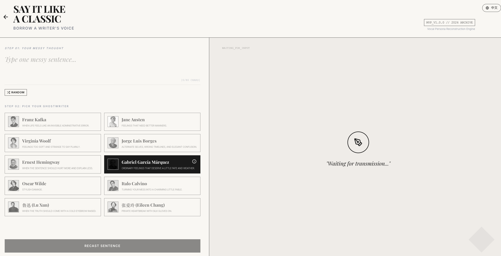
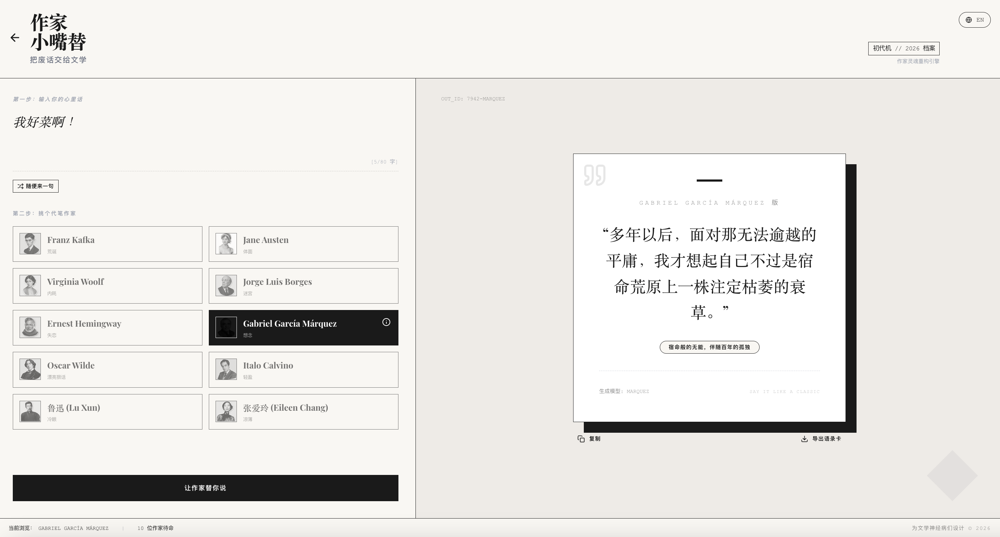

# Borrow a Better Sentence

### *Say it like a classic.*

A playful literary voice app that rewrites everyday thoughts in the style of iconic writers.  
Type one messy sentence, choose a writer, and watch it come back sharper, sadder, funnier, colder, softer, or far more elegant.

[**Live Demo**](https://borrow-a-better-sentence.vercel.app/)

## Overview

**Borrow a Better Sentence** is a small interactive writing experience built around a simple idea:

> You say the feeling.  
> A writer gives it better words.

Instead of generating long stories, the app focuses on **sentence recasting** — taking an ordinary thought, mood, complaint, confession, or late-night fragment and re-expressing it through the literary atmosphere of a distinct author.

It is less of a writing tool and more of a **literary toy**: playful, stylish, and made for comparison, mood, and screenshots.

## What it does

- Type a short everyday sentence
- Pick a literary "ghostwriter"
- Get your line rewritten in a more distinctive voice
- Compare how the *same thought* changes across different writers
- Switch between **English** and **Chinese** interfaces

Example inputs:

- *I’m so bad at this.*
- *I miss him a little.*
- *Boston is so cold today.*
- *I really don’t want to work.*
- *我好菜啊。*

## Writers included

The current version includes 10 iconic writers with clearly separated tonal worlds:

- Franz Kafka
- Jane Austen
- Virginia Woolf
- Jorge Luis Borges
- Ernest Hemingway
- Gabriel García Márquez
- Oscar Wilde
- Italo Calvino
- 鲁迅 (Lu Xun)
- 张爱玲 (Eileen Chang)

Each writer is treated not as a strict style clone, but as a **literary persona filter** — a way of changing tone, rhythm, worldview, and emotional posture.

## Interface Preview

  

  

The visual direction is intentionally:

- editorial
- monochrome
- archival
- literary, but playful
- minimal rather than decorative

The interface is meant to feel somewhere between a **sentence laboratory**, a **writer selection cabinet**, and a **small digital literary archive**.

Most AI writing demos aim for bigger output: essays, stories, summaries, assistants.

This one goes in the opposite direction.

It asks a smaller, stranger question:

**What happens when one ordinary sentence is refracted through ten very different literary minds?**

That constraint makes the app feel lighter, more repeatable, and more fun to share.

## Live app

Visit the app here:

**https://borrow-a-better-sentence.vercel.app/**

